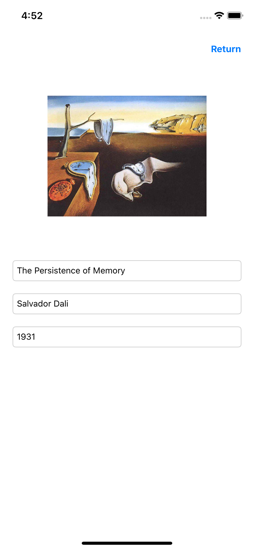

# Art Gallery

### Description

Uses Core Data to save and retrieve images with user supplied attributes. Notification center to call update and reload table view after saving new data.

### Images / Usage

From the main view controller, you can create new entries by selecting the + icon in the navigation bar. Images can be imported from the camera roll, details are entered manually.

 

From the main view controller, you can view existing entries by selecting the table view cell.

Entries can be deleted from Core Data by swiping the table view cell on the main view controller.

